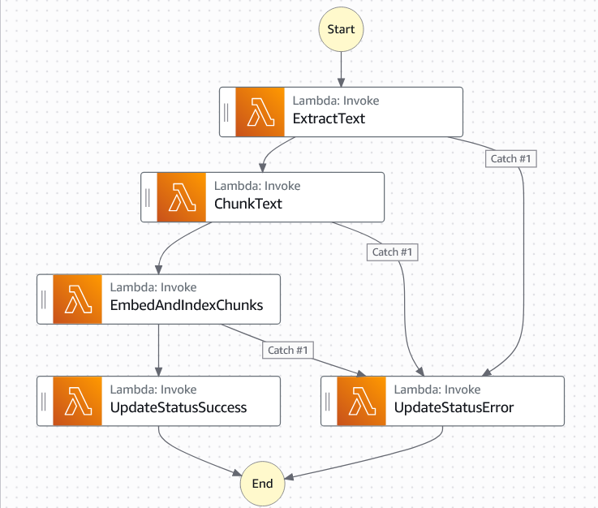

# RAG-PDF Chatbot 🤖📄

A **document-based AI assistant** that allows users to upload a **PDF file** and chat with an AI bot capable of answering questions based on the uploaded content. Built with modern web technologies and a robust cloud-native backend.




---

## 🔍 Description

This app mimics a basic **AI PDF Q&A assistant** in two steps:

1. **Screen 1**: User enters their email to simulate login (stored in `localStorage`).
2. **Screen 2**: A chat UI appears, but interaction is disabled until a PDF is uploaded.

Key functionality includes:

- Upload a **single PDF file (max 10MB)**.
- File is sent to **AWS S3** via a **presigned URL**.
- An **AWS Step Functions** workflow is triggered automatically:
  - Extracts text
  - Chunks it
  - Embeds chunks
  - Indexes embeddings in **Pinecone**
- Once processing succeeds, user can **chat with an AI** based on the document contents.

---

## 📁 Project Structure

```
.
├── client/             # React + Vite frontend
├── server/             # Express backend API
└── lambda-functions/   # AWS Lambda logic used by Step Functions
```

---

## 🚀 Features

- 🔐 Email-based (localStorage) access
- 📄 Single-file upload (PDF, max 10MB)
- 🧠 AI Q&A based on uploaded document
- ☁️ AWS S3 + Step Functions integration
- 📚 Pinecone vector search
- ✨ Modern and sleek chat UI

---

## 🛠️ Tech Stack

### Frontend

- **React 19 + Vite**
- **TailwindCSS 4**
- **Shadcn UI + Lucide Icons**
- **TanStack Query** (polling for file processing)
- **React Router**

### Backend

- **Express 5**
- **AWS SDK** (S3, DynamoDB, Step Functions)
- **Pinecone Vector DB**
- **Gemini API**

---

## ⚙️ Installation

### 1. Clone the Repository

```bash
git clone https://github.com/andrew-dev-p/AWS-RAG-PDF-chat
cd aws-rag-pdf-chat
```

### 2. Setup Client

```bash
cd client
npm install
```

### 3. Setup Server

```bash
cd ../server
npm install
```

---

## 🧪 Running Locally

### Start Client

```bash
cd client
npm run dev
```

### Start Server

```bash
cd server
npm run dev
```

---

## 🔐 Environment Variables

### Client (`client/.env.local`)

```env
VITE_API_URL=http://localhost:3000/api
```

### Server (`server/.env`)

```env
PORT=3000
NODE_ENV=development

AWS_REGION=us-east-1
AWS_BUCKET_NAME=aws-rag-pdf-chat
AWS_ACCESS_KEY_ID=your_access_key_id
AWS_SECRET_ACCESS_KEY=your_secret_access_key

PINECONE_API_KEY=your_pinecone_api_key
GEMINI_API_KEY=your_gemini_api_key
```

---

## ⚙️ Deployment

- **Frontend**: Hosted on **Vercel**
- **Backend**: Deployed on **Render**
- **Storage**: Files saved to **AWS S3**
- **Processing**: AWS **Step Functions** + **Lambda**
- **Vector DB**: **Pinecone**
- **AI Responses**: via **Gemini API**
